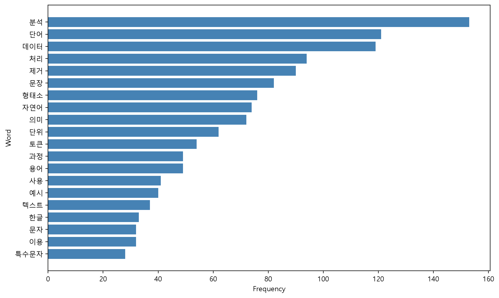
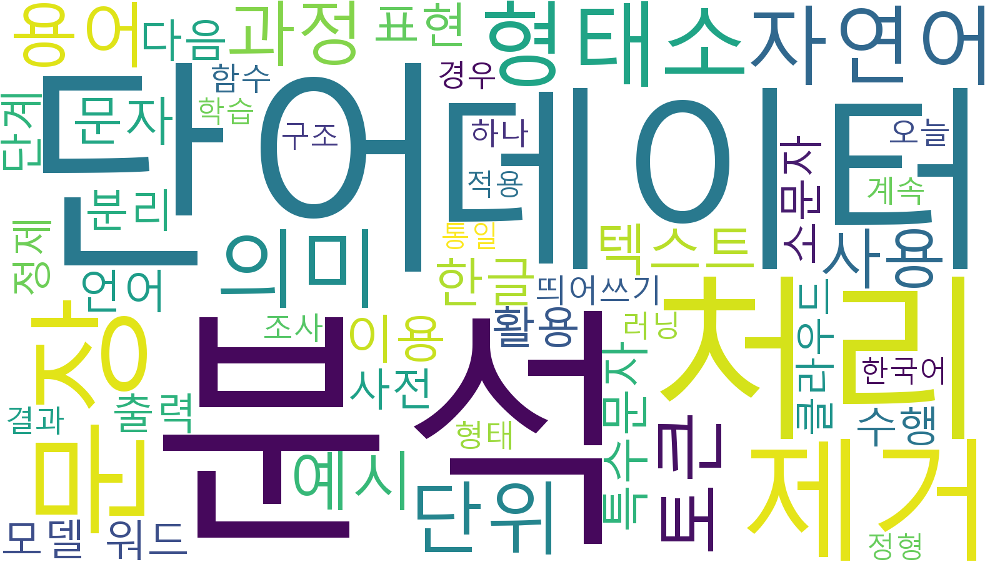

# 워드클라우드 및 명사 빈도 분석 보고서

본 보고서는 강의 자료 PDF에서 추출한 텍스트를 기반으로 명사 추출, 불용어 제거, 빈도 계산, 시각화까지 수행한 결과를 정리한 것이다.

분석 결과, 총 3723개의 명사가 추출되었고 고유 명사는 598개였으며, 가장 많이 등장한 단어는 `분석`으로 153회 나타났다.

## 분석 개요

분석 대상 텍스트에서 핵심 명사를 중심으로 빈도를 계산했고, 결과를 표와 그래프로 정리했다. 상위 5개 명사는 `분석`, `단어`, `데이터`, `처리`, `제거`이며, 이들 단어가 전체 문서의 주제를 가장 직접적으로 반영한다.

## 핵심 결과

상위 10개 단어의 평균 빈도는 94.3회로, 특정 주제어가 문서 전반에 걸쳐 반복적으로 사용되었음을 보여준다. 특히 `분석`과 `단어`, `데이터`의 빈도가 높아 텍스트가 텍스트 마이닝, 전처리, 시각화 관련 설명에 집중되어 있음을 시사한다.

| 순위 | 명사 | 빈도 |
| :-- | --: | --: |
| 1 | 분석 | 153 |
| 2 | 단어 | 123 |
| 3 | 데이터 | 121 |
| 4 | 처리 | 95 |
| 5 | 제거 | 91 |

위 상위 단어들은 첨부된 막대그래프에서도 가장 긴 막대로 확인되며, CSV 파일의 빈도 값과도 일치한다.

## 시각화 해석

워드클라우드에서는 `분석`, `단어`, `데이터`, `처리`, `제거`가 가장 크게 배치되어, 빈도 기반 중요도가 직관적으로 드러난다. 반면 `문자`, `형태소`, `자연어`, `토큰`, `용어` 같은 단어도 함께 나타나, 분석 대상 문서가 한국어 텍스트 처리와 관련된 설명 문서임을 뒷받침한다.

막대그래프는 상위 단어들의 상대적 차이를 더 정확하게 보여준다. 특히 `분석`이 1위이고, 그 다음으로 `단어`, `데이터`가 근접한 수준으로 뒤따르며, 이후 `처리`, `제거`가 안정적으로 분포한다.

## 해석

이 결과는 해당 문서가 단순한 일반 텍스트가 아니라, 한국어 자연어 처리와 워드클라우드 생성 과정을 설명하는 기술 문서임을 보여준다. 높은 빈도를 보인 단어들이 모두 전처리, 추출, 분석, 시각화 흐름과 밀접하게 연결되어 있어, 문서의 중심 주제가 매우 일관적이다.

또한 고유 명사 수가 598개로 적지 않다는 점은, 동일한 핵심 개념이 반복되면서도 다양한 보조 용어가 함께 등장했음을 의미한다. 따라서 본 텍스트는 특정 주제를 반복 설명하는 교육형 또는 실습형 문서로 해석하는 것이 타당하다.

## 결론

종합하면, 한국어 텍스트 전처리와 명사 기반 빈도 분석에 초점을 둔 자료이며, `분석` 중심의 반복 구조가 강하게 나타난다. 워드클라우드와 막대그래프는 이 패턴을 시각적으로 잘 보여준다.
